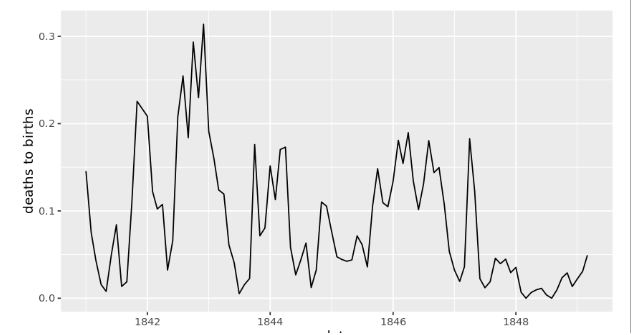
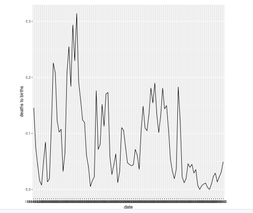

# First troubles with data and R
## or how to fix a plot using ggplot2 library and proper methodology steps

Few weeks ago, I started learning R, so I also started using it to process and analyze data. Everything was smooth until I decided to do a project using the dataset analyzed previously. Suddenly, the same code was giving me different results. What happened?

Data types happened, but let's start from the beginning.

I need a structure in my learning, so I chose DataCamp to be my guide at the beginning. They offer courses and projects of various degrees of complexity, and beginner projects can be done in a guided and unguided mode. My first guided project went smoothly, and troubles started when I wanted to repeat it in the unguided mode.

I was working with the Dr. Semmelweis' dataset, in which he collected data about deaths during childbirth in two clinics yearly, and monthly in one of them. I was supposed to plot the ratio of deaths to births, and this is when my troubles began.

I tried to use the same code as in the guided version of the project:
```R
ggplot(monthly, aes(x = date, y = proportion_deaths)) +
geom_line() + 	   
xlab("date") +
ylab("deaths to births")
```

It didn't work! Or rather, it worked, but not the way I wanted. Instead of a nice plot like previously:



I've got this disaster:


This was not good! There was no graph, and scale was a hot mess. I wanted a scale on x axis to be expressed in years, and I had no clue what happened to my plot. First hint came from the console:
```
geom_line(): Each group consists of only one observation. 
ℹ Do you need to adjust the group aesthetic?
```

I've pulled a documentation of ggplot2, and quickly found out how to fix that. I modified my code:
```R
ggplot(monthly, aes(x = date, y = proportion_deaths)) +
geom_line(aes(group = 1)) + 	   
xlab("date") +
ylab("deaths to births")
```

The graph appeared:



This was only a partial win because my scale was still really messy. I started browsing documentation for scale adjusting functions, and I found `scale_x_date()`, which looked like the answer my troubles. It didn't work. I tried many configuration of parameters, and all of the were giving me very long error messages. I started browsing StackOverflow, and all the hints lead back to `scale_x_date()`, so I realized that my problem lays somewhere else. I couldn't understand why guided version of the project gave different results as well. Something had to be be different either in data processing or in data itself. Then, I decided to **read the error message carefully**. I know, I should do it right away... Something something `chr` class and `date` class, and a lot of trackbacks. Of course... data types! I've looked at my data closer:
```
Rows: 98 
Columns: 4 
$ date <chr> "1841-01-01", "1841-02-01", "1841-03-01", "1841-04-0… 
$ births <int> 254, 239, 277, 255, 255, 200, 190, 222, 213, 236, 23… 
$ deaths <int> 37, 18, 12, 4, 2, 10, 16, 3, 4, 26, 53, 64, 38, 27, … 
$ proportion_deaths <dbl> 0.145669291, 0.075313808, 0.043321300, 0.015686275, …`
```

I realized that dates in the `montly` table are in `chr` class. One mystery solved: `scale_x_date()` works with `date` type data, so that's why it didn't work. I also understood why my scale was messy - ggplot2 has placed entire dates on the scale. At this point I panicked a bit because I had no clue how to extract a part of a string in R from the variable in the data frame. I imagined a necessity to write a complex wall of code to do that with regex... Suddenly, I've reminded myself about type casting, and started googling how to do that in R on entire column. Long tail search and StackOverflow came to my rescue:
```R
monthly$date <- as.Date(paste(monthly$date, "-01", sep = ""))
```

This single line fixed all my problems! After adding it to my code, my dates data class changed to `date`:
```
Rows: 98 
Columns: 4 
$ date <date> 1841-01-01, 1841-02-01, 1841-03-01, 1841-04-01, 184… 
$ births <int> 254, 239, 277, 255, 255, 200, 190, 222, 213, 236, 23… 
$ deaths <int> 37, 18, 12, 4, 2, 10, 16, 3, 4, 26, 53, 64, 38, 27, … 
$ proportion_deaths <dbl> 0.145669291, 0.075313808, 0.043321300, 0.015686275, …
```

My plot finally looked like I wanted:


Success!

## Lessons Learned

1. Always study your data set before analysis, and check data types (classes) of all variables, and such, it may save you few hours.
2. Read error messages carefully. They may not bring the direct answer, but they will give a solid hint at least.
3. The same dataset doesn't always mean completely the same: some data types (classes) may be different depends on who prepared the set and for what purpose! In my case, in the first set from the guided version, date column had values in `date` class, in the second set, it was in `chr` class, even though the content of dataset was the same! 
4. Follow a well established method to avoid such mistakes.

I am very aware that I made basic newbie mistakes and approached the problem without having a good methodology. My first mistake was to assume that I work with exact the same dataset. My second mistake was to jump straight to the task without a proper exploration of dataset I worked with. My third mistake was not to read the error message carefully - at first I assumed a syntax error and wrong choice of `scale_x_date()` parameters. I learned my lesson. Even though I lost few hours, I consider that day very productive. I learned more R, I studied ggplot2 documentation quite thoroughly, and I started building a methodology.
